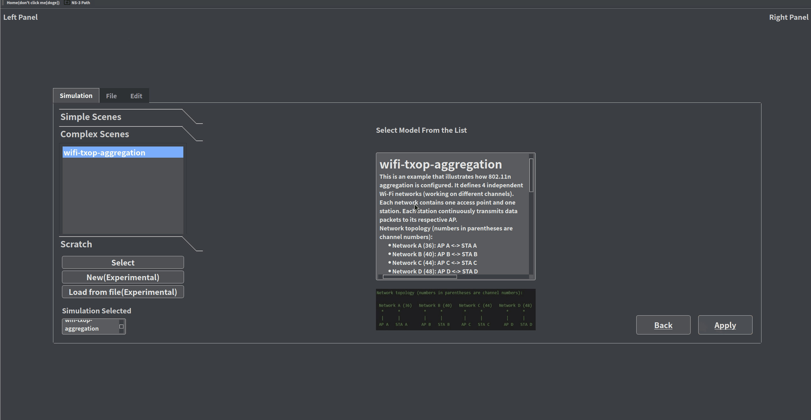
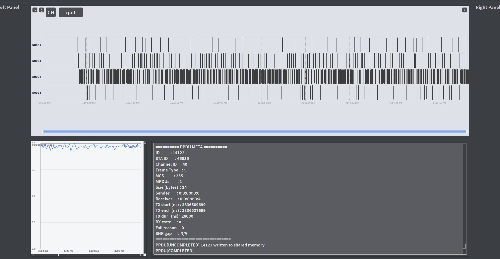
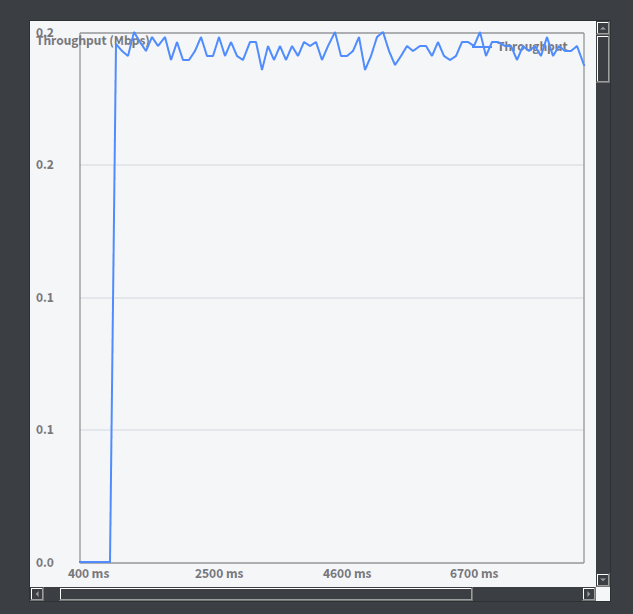
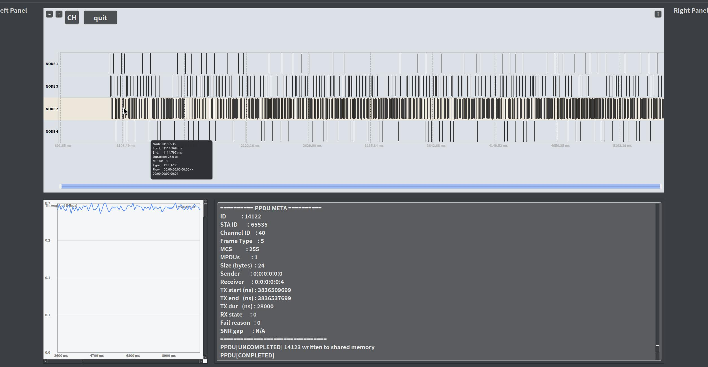
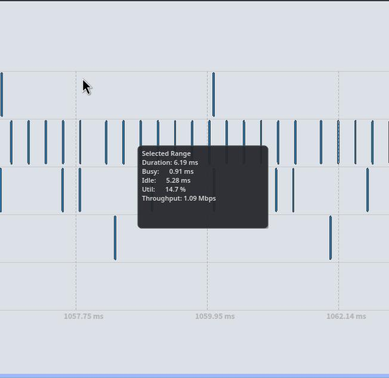
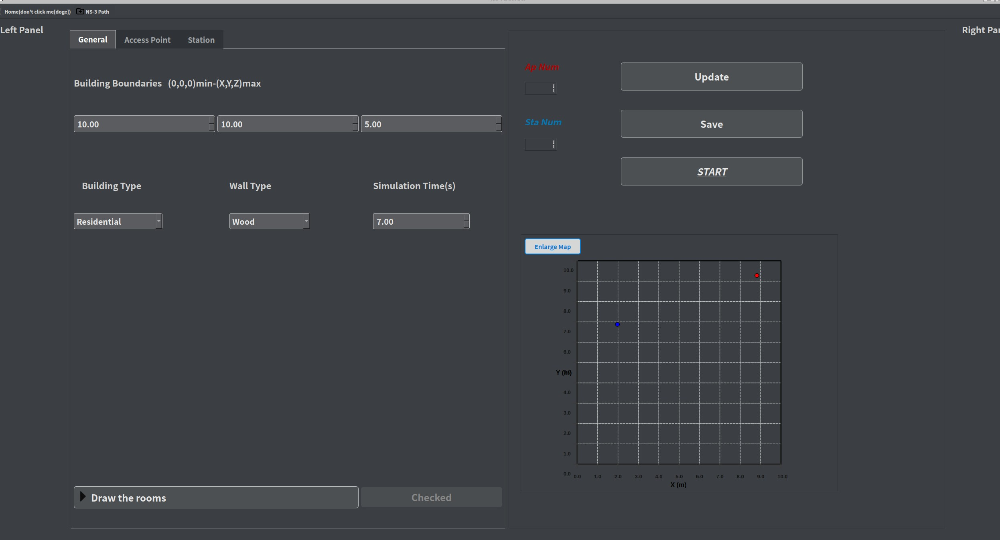
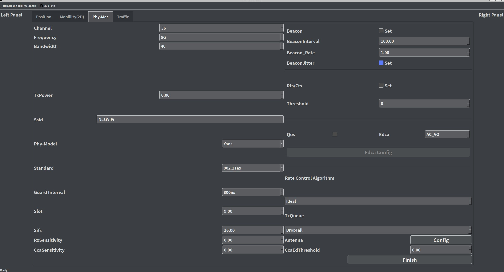

# Ns-3 PPDU Visualizer

[English](doc/README_en.md) | [中文](doc/README_ch.md)

A Qt-based visualization tool for **ns-3 PHY/MAC PPDU activity**, designed to provide **interactive, time-aligned PPDU-level analysis** for wireless simulations.

This repository provides a **research-oriented visualization frontend** that complements ns-3 experiments by transforming low-level PHY/MAC events into **clean, readable timelines and statistics**. It is optimized for **debugging, analysis, and reporting** in wireless systems research, rather than for general-purpose network animation.

### ✅ Key Highlights
- **PPDU-first analysis**: focused on PHY/MAC PPDU behavior and collisions.
- **Time-accurate inspection**: nanosecond-level time alignment with zoomable timelines.
- **Interactive diagnosis**: hover/drag/zoom/select workflows designed for fast triage.
- **Scenario extensibility**: support for custom simulation scenarios and project files.

### 🎯 Typical Use Cases
- Investigate **collision patterns** or contention anomalies.
- Compare **per-node throughput** under different configurations.
- Perform **time-windowed utilization analysis** for bottleneck diagnosis.
- Generate **figures for papers/reports** from PPDU timelines.


This project focuses on **PPDU timelines, throughput plots, and custom simulation scenarios**, supporting:
- Node-centric PPDU transmissions
- Channel-centric PPDU transmissions
- PPDU collision indication
- Frame type inspection
- Time range selection with auto-zoom
- Throughput / channel utilization statistics

> this shows the PPDU-Timeline and Throughput plots of a wireless scenario in ns-3 (examples/wireless/wifi-txop-aggregation.cc)
 


- > Besides the PPDU-level analysis, this tool also provides a Throughput plot to help you analyze the possible bottlenecks of the wireless network.
  
---

## ✨ Features

- 📊 **PPDU Timeline View**  
  Visualize PPDU transmissions along the time axis in **node view** and **channel view**.

- 🧠 **Lane-based Overlap Layout**  
  Overlapping PPDUs are split into lanes to avoid occlusion, with overlap indicators.

- 🖱 **Rich Interaction**
  - Hover to inspect PPDU details (frame type, duration, fail-reason, node MAC, etc.)
  - > when you hover your mouse over a triangle which represents a PPDU, you can see the detailed information of the PPDU, including the frame type, duration, node MAC, etc.The channel would be highlighted too.
 
It is intended as a **research and debugging tool**, not a full simulator or NetAnim replacement.
  - Left-drag to pan the timeline
  - Mouse wheel to zoom and adjust time granularity
  - Right-drag to select a time range and compute statistics
  - > 

- 📐 **Time Range Analysis**
  For a selected interval (requires full-data mode):
  - Channel busy time
  - Idle time
  - Utilization
  - Throughput (Mbps)
  - > 

- 🪟 **Overlay UI (NetAnim-style)**
  Semi-transparent overlays for:
  - PPDU info
  - Legend
  - Statistics

- 🖼 **Export as Image**  
  Save the current timeline view as PNG/JPG.

---

## 🧩 How It Works (Conceptual Pipeline)
1. **ns-3 simulation** produces PHY/MAC PPDU trace outputs (JSON/CSV).
2. **Parser layer** converts raw trace data into PPDU objects.
3. **Layout engine** assigns lanes and computes overlaps.
4. **Qt UI layer** renders the timeline, overlays, and plots.
5. **Interaction layer** provides zoom/selection/statistics.

This design keeps the visualization **decoupled from simulation**, enabling reproducible analysis across multiple experiments.

---
## Design your own scenario(Build your simulation scene by yourself)


> If you don't want to create a scenario by writing code, you can try the **New(Experimental)** button in the **Simulation Mode Selection** page.But just as the text suggests, this feature is still experimental and may not work as expected in some special cases.
We are now working hard to perfect this DIY simulation mode,the key problems lies in the configuration of flow settings and the mobility model. We will keep this tool updated as soon as possible.
- > Any issue report or suggestion is welcome!

> Settings for APs and STAs are modifiable in the setting page.
- 
## Load from File

> This feature allows you to load a custom scenario from a project file (.nsproj). The project file can be generated by the Ns3Visualizer UI.
> The project file contains all the necessary information for the simulation, including the topology, mobility model, and flow settings.
The Ns3Visualizer UI will load the project file and display the corresponding simulation scenario.

> ⚠️ **Note**  
> When using the AppImage version, the relative positions of the Qt UI and the ns-3 simulation are not fixed. The user needs to manually set the paths in the UI.

---

## 🔧 Dependencies

- **Qt 6 and the related tool chains** (Qt 5 may work with minor tweaks)
- **C++17** or newer
- **ns-3.46** or higher
- Linux environment

> ⚠️ **Note**  
> This repo does **not** ship the full ns-3 source. Only contrib modules are included. Please download the full ns-3 source from the [ns-3 official site](https://www.nsnam.org/).

---

## 🚀 Quick Run (Prebuilt)

- **AppImage** (desktop)  
  Run Ns3Visualizer.AppImage to launch the UI.

- **Headless executable package**  

```bash
# place Ns3Visualizer/ under contrib/
./ns3 configure
./ns3 build
./build/Ns3VisualizerApp

```

> The Qt app only handles visualization; it does **not** build or run ns-3.
> If you want to know more about how to use this tool, please refer to the [User Guide](Tutorial_en.md) or [用户指南](Tutorial_ch.md).

---

## 🧭 Recommended Workflow
1. **Generate traces** in ns-3 (enable PPDU/PHY/MAC tracing).
2. **Load the trace** in the visualizer UI.
3. **Inspect** timeline and throughput plots.
4. **Select a time range** to compute utilization statistics.
5. **Export images** for reports or debugging.

---

## 📥 Data Input

PPDU data typically comes from ns-3 trace hooks or custom logs (JSON/CSV).
Each PPDU record usually includes:
- Node/AP identifier
- Start/end time (ns)
- Frame type
- Aggregated MPDU count
- Payload size

### ✅ Recommended Data Quality
- Ensure timestamps are strictly monotonic within each node.
- Provide explicit frame types for reliable legend grouping.
- Use consistent units (ns recommended) to avoid scaling errors.

---

## 🧪 Project Status

- ✔ PPDU timeline and overlays
- ✔ Time-range statistics
- ✔ Interactive operations
- ⏳ Complex traffic configuration
- ⏳ MLO

---

## 🎯 Design Goals

- Focus on PHY/MAC behavior rather than topology animation
- Nanosecond-level time alignment
- Research-friendly and extensible

---

## 📜 License

Released under the **MIT License**.

---

## 🙋 Authors

- **Kai Zhang**  
  u202414527@hust.edu.cn
- **Chengxiang Mi**  
  michengxiang@hust.edu.cn

---

## ⭐ Acknowledgements

- ns-3 Simulator
- NetAnim (UI inspiration)
- Qt Framework

> If you use this project in research, coursework, or tooling, a citation or mention would be appreciated.

---

## 🤝 Contributing
Contributions are welcome, especially for:
- Additional trace adapters (custom log formats)
- Improved scenario configuration
- UI/UX improvements for heavy-scale simulations
- Documentation and reproducibility guides

Please open issues or pull requests with clear steps to reproduce and expected behavior.

---

## 📌 Citation (Suggested)
If you use this tool in academic work, please cite it as a software artifact and mention the authors.

---

## 📮 Contact
For questions or collaboration, feel free to reach out to the authors listed above.
