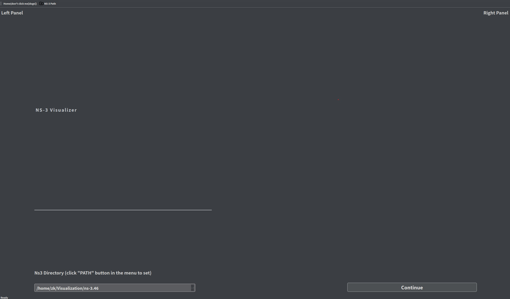
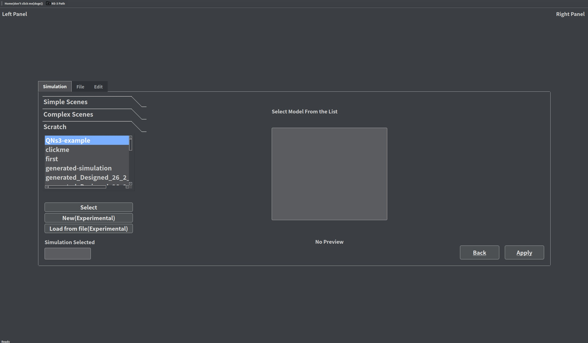
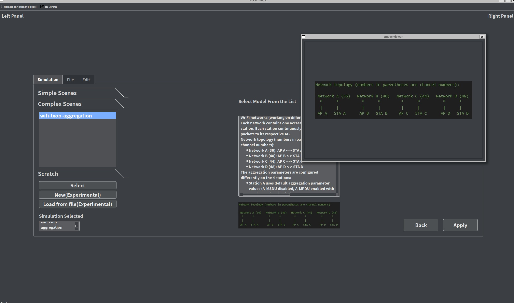
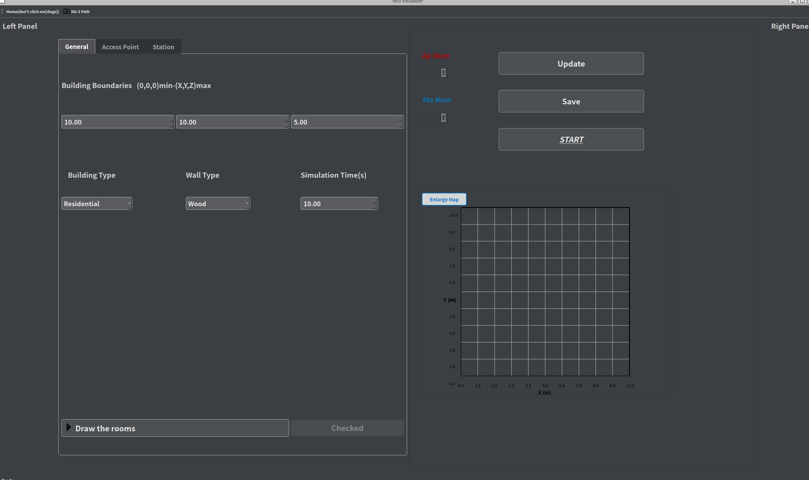
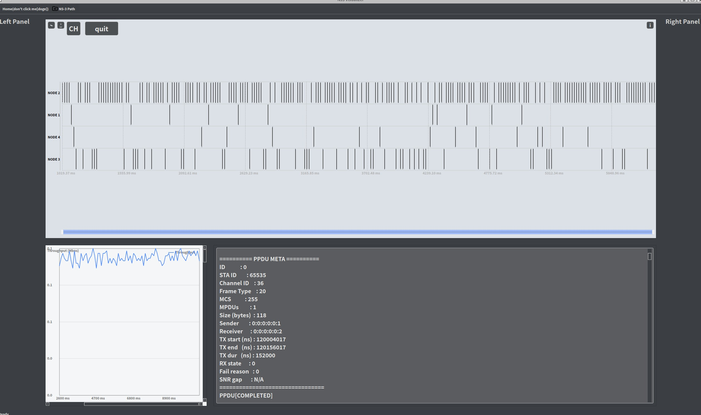

# Ns3Visualizer用户手册
- [返回README](README_ch.md)
---
### 组件版本以及依赖
- Qt 6.10.2
- ns-3.46
- C++17 或更新标准
- Linux 环境
  
---
### 初始界面
  

- 用户需要在顶端按钮**ns-3 path**设置ns-3文件夹路径,选择ns3路径,软件会自动检测选择的ns3路径是否有效.
- 设置成功以后,点击**continue**按钮进入**仿真模式选择界面**.

---
### 仿真模式选择界面
  

- 用户可以选择**已有场景仿真**或**自定义场景仿真**.
- > 已有场景仿真:可以点击"Simple Scenes","Complex Scenes"以及"Scratch"选择已有场景,点击**Select**,再点击**Apply**开始仿真.其中,"Scratch"自动从ns3目录中读取仿真脚本.
  
  

- > Simple/Complex Scenes的设计初衷:能够使用户快速上手ns3,并且展示一些典型的无线网络场景+PPDU-Timeline视图.
- > Scratch :用户若已经有自己的仿真脚本,想要使用PPDU时序图来辅助分析,那么只需要将自己的脚本放入ns3/scratch目录下,并在此处选择即可.
  ```cpp
  /*=======使用PPDU时序图对仿真代码的要求=======*/
  // 头文件包含:
  include "ns3/SniffUtils.h"
  /*
  your simulation 
  */
  // 在simulation stop之前加上:
  Ptr<SniffUtils> Sniff_Utils = CreateObject<SniffUtils>();
  Sniff_Utils->Initialize(staDevices, apDevices, duration);
  ```

- **New**按钮,使得用户能够进行免代码的仿真自定义(DIY仿真)[见下文]
- **Load from File**按钮,使得用户能够从项目文件(.nsproj)中加载自定义场景.[见下文]

---
### 仿真场景自定义界面
  

- > 可以看到有三个标签页,分别是General,Access Point,Station.分别对应仿真场景的总体设置,AP的设置以及STA的设置.
- > 依次完成各项参数的设置,可以在右下侧的建筑场景图中拖动各个节点的位置,并且可以放大建筑图调整细节.完成以后**点击Update按钮**更新场景配置.
- > **Save**按钮,可以将当前的场景配置保存到项目文件(.nsproj)中,以便下次加载使用.
- > **Start**按钮,可以开始仿真,并且进入PPDU时序图界面(./ns3 build需要一定的时间,等待几秒页面才进行跳转是正常的).
  
### PPDU时序图界面
  
- > 该界面展示了仿真过程中每个PPDU的发送和接收情况.每条水平线代表一个节点,每个矩形代表一个PPDU,矩形的长度代表PPDU的持续时间.用户可以通过将鼠标悬停在矩形上查看PPDU的详细信息.
- > 左上四个按钮分别是:**保存当前视图**,**调整时间段**,**切换信道/节点视角**,**退出当前仿真**
- > 右上角的按钮是:**图例**
- > 左下为吞吐量折线图,右下为PPDU详细参数